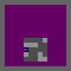
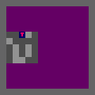
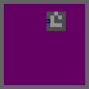

# Dynamic Environment Generation for UED

<p align="center">
    
    
    
</p>

Dynamic Environment Generation for Unsupervised Environment Design provides a new method for generating environments to train reinforcement learning agents.

## Installation

The easiest method to install and setup the run experiments is to use docker. The docker image can be built using 

```bash
make build
```

and the container can be run using

```bash
make run
```

## Method

For both Minigrid and Key Minigrid, we have included DEGen as well as a number of UED baselines. These can be found in the `minigrid` and `key_minigrid` directory respectively. The following ued methods are included:

| UED Method | File Name                |
|------------|-------------------------|
| DEGen      | maze_obs_gen.py         |
| DR         | maze_dr.py              |
| PLR      | maze_plr.py           |
| PAIRED     | maze_paired.py          |

for accel, set the `use_accel=True` flag for PLR, e.g. 

```bash
python maze_plr.py use_accel=True
```

The SFL code is included in the SFL directory

## Metric

To select the metric used for PLR, ACCEL and DEGen, use the score function flag, e.g. `score_function=mna`

| Metric                      | Flag Name | Description                                                                                   |
|-----------------------------|-----------|-----------------------------------------------------------------------------------------------|
| Maximised Negative Advantage| `mna`     | $\left(\dfrac{1}{T} \sum_{t=0}^T \hat{G}_t^{\lambda} \right) \cdot \hat{C}$                   |
| Positive Value Loss         | `pvl`     | $\dfrac{1}{T} \sum_{t=0}^T \left( \max(0, \sum_{k=t}^T (\lambda \gamma)^{k-t} \delta_k) \right)$ |
| Maximum Monte Carlo         | `MaxMC`   | $\dfrac{1}{T} \sum_{t=0}^T \left( R_{max} - \hat{V}(s_t) \right)$                             |

## Example Levels

Below are example images from DEGen. Note that the purple regions are sections of the level that are not observed at any point during the rollout, and so have not been generated. More level images can be seen in the `Example Levels` folder.

<table>
    <tr>
        <th>Minigrid</th>
        <th>Key Minigrid</th>
        <th>Key Minigrid</th>
    </tr>
    <tr>
        <td align="center">
            
        </td>
        <td align="center">
            
        </td>
        <td align="center">
            
        </td>
    </tr>
</table>
